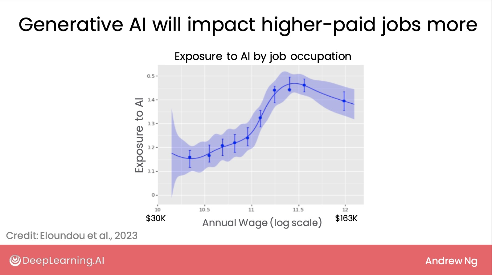
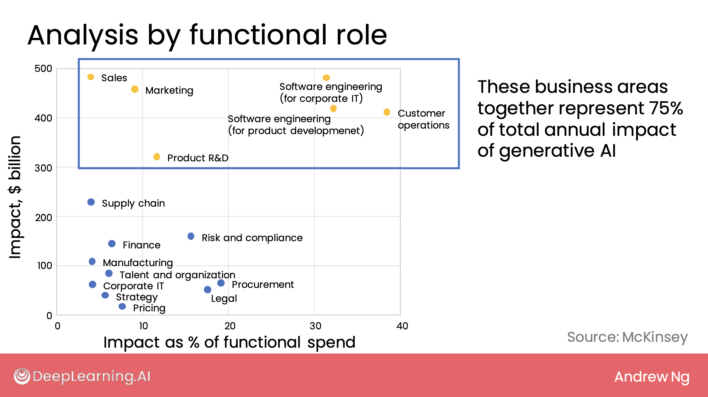
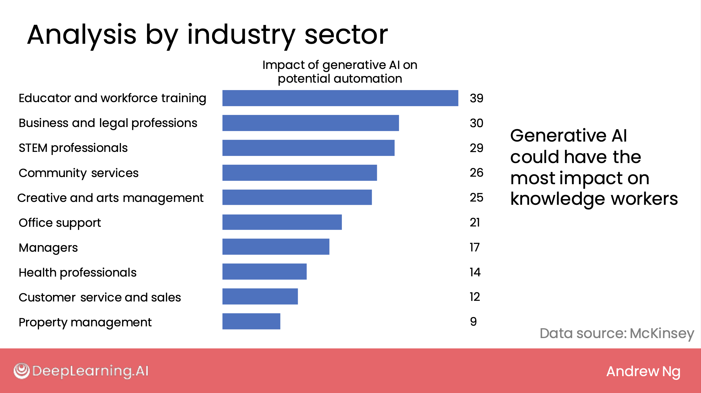

# Lesson 6: Automation Potential Across Sectors

## 1. Overview

This lesson explores how generative AI affects job roles across companies and its influence on different industry sectors. While not all insights are immediately actionable, they provide a broader understanding of long-term macro changes driven by AI.

## 2. Study by Eloundou et al. (OpenAI + University of Pennsylvania)

- This study analyzed **AI exposure across occupations**.
- **Key finding**: Higher-wage jobs (高收入工作) are more exposed to AI **augmentation (增强)** and **automation (自动化)** compared to lower-wage jobs.
- Traditional AI (e.g., supervised learning 监督学习) automated lower-wage, repetitive work.
- Generative AI (生成式人工智能) now targets more **cognitive, knowledge-intensive tasks (知识密集型任务)** done by higher-paid workers.
- The horizontal axis (x-axis) was on a **log scale (对数刻度)**, plotting salaries from \$30K–\$163K.
- Vertical axis (y-axis) shows **degree of exposure (暴露程度)** to automation.

## 3. Study by McKinsey – Functional Role Analysis

- Analyzed generative AI's impact across **business functions (职能角色)** like sales, marketing, legal, and customer operations.
- **Y-axis**: Absolute impact in billions USD (影响的美元总额)。
- **X-axis**: Impact as a percentage of total function spend (占职能支出的百分比)。
- **Customer Operations (客户运营)**:
  - Largest estimated impact: ~$400B.
  - Up to 40% of function spend.
- **Sales and Marketing (销售与市场营销)**:
  - Also high dollar value but smaller percentage impact.
- Yellow dots = Functions representing 75% of estimated total value impact.
- Even small percentages (e.g. 15–20% in Legal 法律行业) are significant due to industry size and norms.

## 4. McKinsey – Industry Sector Analysis

- Compared impact of AI with and without generative AI across **industry sectors (行业领域)**.
- Replotted to highlight **only generative AI’s contribution**.
- Top affected sectors:
  - **Education and workforce training (教育与劳动力培训)**
  - **Business and legal professions (商业和法律职业)**
  - **STEM professionals (理工类专业人员)**
- Generative AI is shifting automation potential in sectors that were **previously less affected**.
- A large portion of this impact is on **knowledge workers (知识工作者)**:
  - Workers who create value through **expertise (专业知识)**, **critical thinking (批判性思维)**, and **interpersonal skills (人际交往能力)**.
  - Contrasts with physical labor roles, which are less exposed to generative AI automation.

## 5. Conclusion

- Generative AI is expected to reshape business and job roles across functions and sectors.
- Macro-level trends indicate a shift toward automating **non-routine cognitive tasks**.
- This concludes the business module. The next module focuses on how AI impacts **society (社会)** and how to build **beneficial and responsible AI (负责任的AI)**.